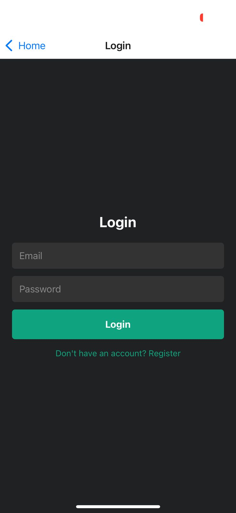
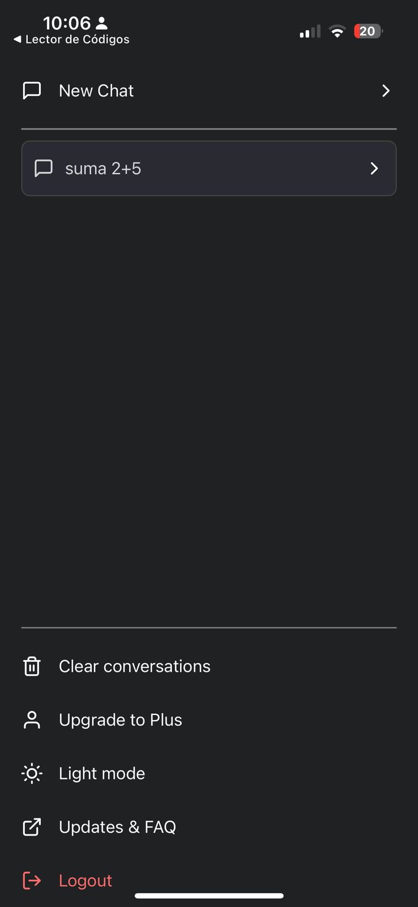
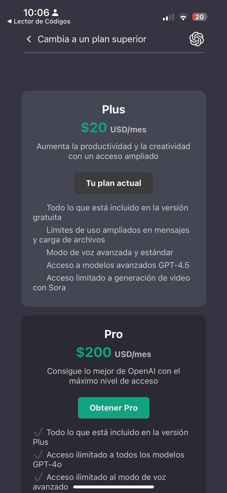
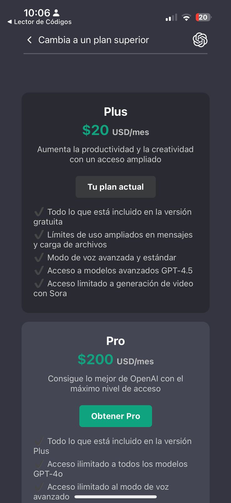
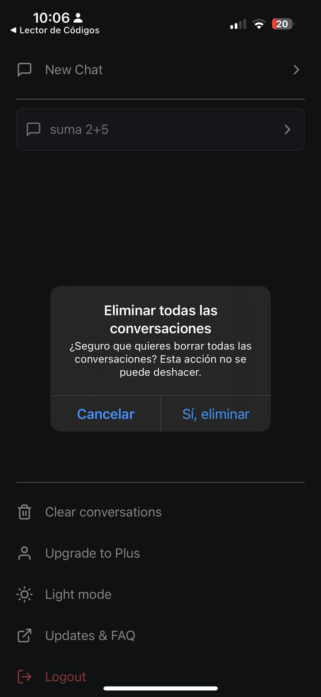
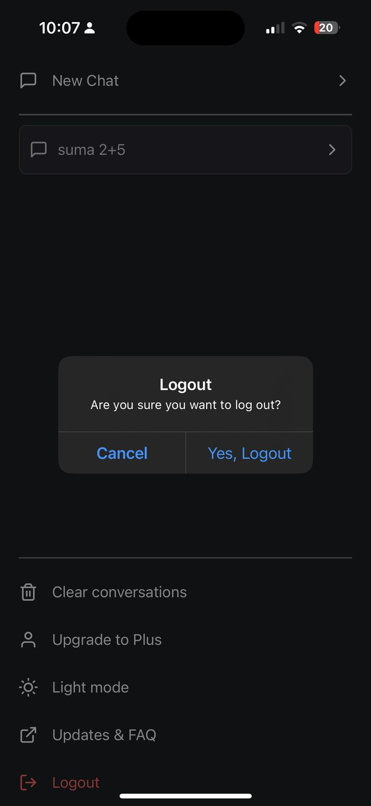
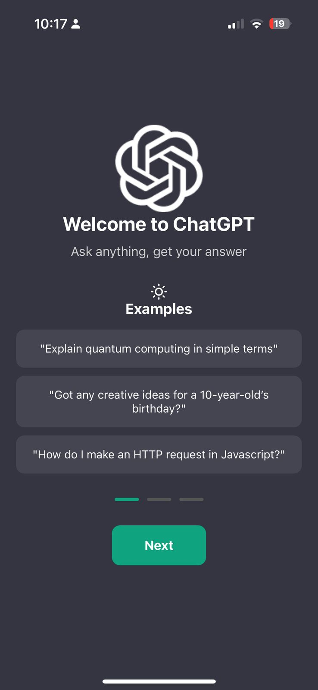
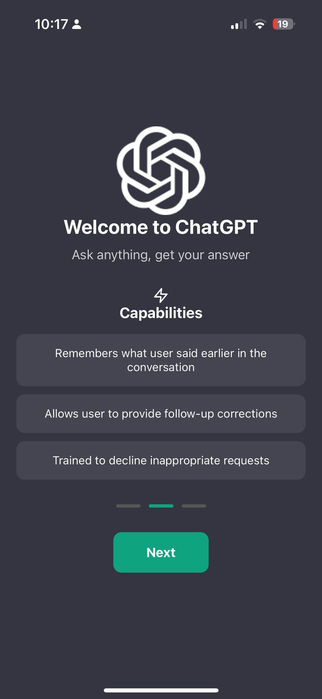
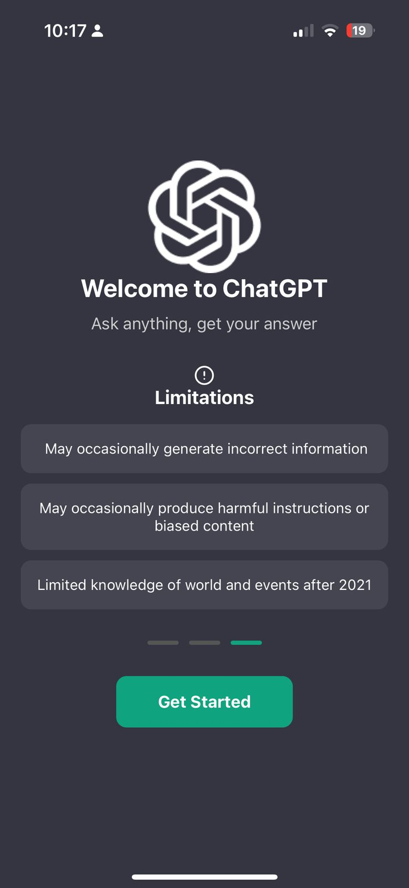
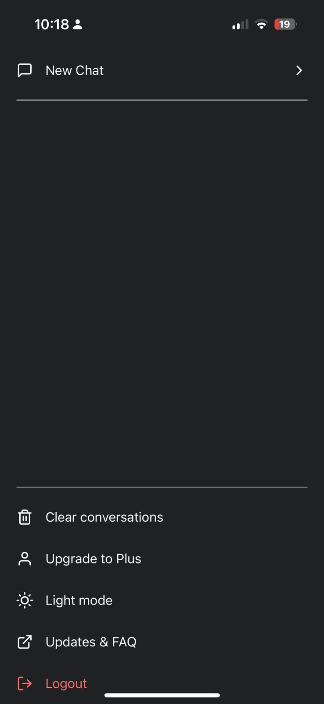

# Aplicación de Chat con React Native y Firebase

## Información del Proyecto
- **Universidad:** Universidad de La Sabana  
- **Facultad:** Facultad de Ingeniería  
- **Materia:** Desarrollo Móvil  
- **Profesor:** Hans Camilo Correa Castro  

## Creado por
| Nombre | Correo Electrónico |
|--------|--------------------|
| Mariana Valle Moreno | marianavamo@unisabana.edu.co |

## Estructura de la Documentación
- [1. Introducción](#1-introducción)
- [2. Tecnologías Utilizadas](#2-tecnologías-utilizadas)
- [3. Instalación y Configuración](#3-instalación-y-configuración)
- [4. Funcionalidades Clave](#4-funcionalidades-clave)
- [5. Autenticación y Seguridad](#5-autenticación-y-seguridad)
- [6. Mejoras Futuras](#6-mejoras-futuras)
- [7. Herramientas Útiles](#7-herramientas-útiles)
- [8. Capturas de Pantalla](#8-capturas-de-pantalla)

---

## 1. Introducción
Este repositorio contiene una aplicación de chat basada en inteligencia artificial con ChatGPT, desarrollada en React Native. La aplicación permite a los usuarios interactuar con un asistente virtual, almacenar conversaciones en Firebase, crear una cuenta, eliminar todas sus conversaciones, explorar los diferentes planes de suscripción disponibles y acceder a una sección de preguntas frecuentes con información relevante.

La arquitectura se basa en **Expo Router** para la navegación y **Firebase** para la autenticación y almacenamiento de datos. Además, se utiliza la **API de Google Cloud** para la generación automática de respuestas en las conversaciones.

---

## 2. Tecnologías Utilizadas

| Tecnología             | Descripción                                       |
|-----------------------|-------------------------------------------------|
| **React Native**      | Framework para desarrollo móvil multiplataforma. |
| **Expo Router**       | Sistema de navegación basado en rutas para Expo. |
| **Firebase Authentication** | Servicio de autenticación de usuarios. |
| **Firebase Firestore** | Base de datos en la nube para almacenar chats. |
| **Google Cloud API**  | Servicio para la generación de respuestas inteligentes. |

---

## 3. Instalación y Configuración

### 1. Clonar el repositorio
```sh
git clone https://github.com/tu-usuario/tu-repositorio.git
cd tu-repositorio
```

### 2. Instalar dependencias
```sh
npm install
```

### 3. Configurar Firebase
#### 1. Crear un proyecto en Firebase Console:
[Acceder a Firebase]([https://firebase.google.com/?hl=es-419])

#### 2. Agregar una aplicación web o móvil y obtener las credenciales.

#### 3. Crear un archivo `FirebaseConfig.js` dentro de `/utils/` y agregar el siguiente código:
```js
import { initializeApp } from "firebase/app";
import { getAuth } from "firebase/auth";
import { getFirestore } from "firebase/firestore";

const firebaseConfig = {
  apiKey: "TU_API_KEY",
  authDomain: "TU_AUTH_DOMAIN",
  projectId: "TU_PROJECT_ID",
  storageBucket: "TU_STORAGE_BUCKET",
  messagingSenderId: "TU_MESSAGING_SENDER_ID",
  appId: "TU_APP_ID"
};

const app = initializeApp(firebaseConfig);
export const auth = getAuth(app);
export const db = getFirestore(app);
```

### 4. Ejecutar la aplicación
```sh
npm run start
```

---

## 4. Funcionalidades Clave

### Chat con IA
- Almacenamiento de conversaciones en Firebase.
- Respuestas en tiempo real utilizando la API de Google Cloud.
- Interfaz optimizada para experiencia de usuario intuitiva.

### Planes de Suscripción
- Opción para visualizar plan **Plus** y **Pro** con características exclusivas.

### Sección de Preguntas Frecuentes
- Lista de preguntas frecuentes para guiar a los usuarios.
- Información detallada sobre los planes y el funcionamiento de la aplicación.

---

## 5. Autenticación y Seguridad
La aplicación utiliza **Firebase Authentication** para la gestión de usuarios con correo electrónico y contraseña. Se aplican medidas de seguridad para evitar accesos no autorizados y se redirige automáticamente a los usuarios no autenticados.

---

## 6. Posibles Mejoras Futuras
- Implementación de un modo offline para acceder a conversaciones previas sin conexión.
- Optimización del almacenamiento en **Firestore**.
- Implementación de un sistema de **notificaciones push** para alertas en tiempo real.
- Posibilidad de personalizar el chatbot con diferentes modelos de IA.

---

## 7. Herramientas Útiles
- **[React Native Docs]([https://reactnative.dev/docs/environment-setup])**
- **[Introduction to Expo Router Docs]([https://docs.expo.dev/router/introduction/])**
- **[Firebase Docs]([https://firebase.google.com/docs?hl=es-419])**
- **[Google Cloud APIs & Services]([https://console.cloud.google.com/apis/dashboard?hl=es-419&project=dam-chatgpt-2025-7eba5])**

---

## 8. Capturas de Pantalla
A continuación, se adjuntas capturas de pantalla de la aplicación para ilustrar su funcionamiento.

```
























```
